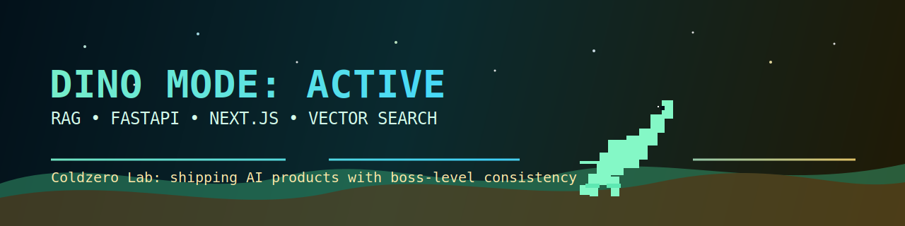

<div align="center">
  
</div>

<div align="center">



[](https://www.linkedin.com/in/coldzero)
[](https://github.com/coldzero94)


</div>

---

## 🦖 Dino Mode

- **DINO MODE**: I break through every obstacle and keep shipping at full speed.
- This profile is built as an AI engineering showroom with aggressive execution energy.
- Goal: make visitors feel product momentum and technical depth in the first few seconds.

<div align="center">
  <a href="https://chromedino.com/" target="_blank">
    
  </a>
  <a href="https://github.com/coldzero94?tab=repositories" target="_blank">
    
  </a>
</div>

---

## 🐍➡️🦖 Contribution Run

<div align="center">

_Animated Dino Run Loop: one dino exits left, next dino enters right (no fade loop)_

<picture>
  <source media="(prefers-color-scheme: dark)" srcset="https://raw.githubusercontent.com/coldzero94/coldzero94/output/github-contribution-grid-dino-dark.svg" />
  <source media="(prefers-color-scheme: light)" srcset="https://raw.githubusercontent.com/coldzero94/coldzero94/output/github-contribution-grid-dino.svg" />
  
</picture>

</div>

---

## 📊 Language Stats

<div align="left">

**Total Code Across All Repositories: 38.1 MB** _(Auto-updated: 2026-02-25)_

```python
# Real data from all my repositories
languages = {
    'Python':  21.9,  # 57.5%
    'TypeScript':  10.9,  # 28.7%
    'JavaScript':   3.2,  #  8.3%
    'Go':   1.3,  #  3.4%
    'Java':   0.2,  #  0.6%
}
```

<!-- Custom Language Stats with Animation -->
```
Python       ████████████████████░░░░░░░░░░░░░░░░ 57.5%  (AI/ML, FastAPI, Django)
TypeScript   ██████████░░░░░░░░░░░░░░░░░░░░░░░░░░ 28.7%  (Next.js, React, Node.js)
JavaScript   ██░░░░░░░░░░░░░░░░░░░░░░░░░░░░░░░░░░  8.3%  (Frontend, Web)
Go           █░░░░░░░░░░░░░░░░░░░░░░░░░░░░░░░░░░░  3.4%  (Backend, Microservices)
Java         ░░░░░░░░░░░░░░░░░░░░░░░░░░░░░░░░░░░░  0.6%  (Backend, Spring)
Others       ░░░░░░░░░░░░░░░░░░░░░░░░░░░░░░░░░░░░  1.5%  (Shell, Docker, Config)
```

</div>

_🤖 Auto-updates daily via GitHub Actions_

---

## ⚙️ Stack Focus

<div align="center">


</div>

---

## 🎯 What I Build

- **RAG Systems**: retrieval quality, latency, cost를 동시에 최적화
- **Semantic Search**: 임베딩/인덱싱/재순위화까지 end-to-end 설계
- **Backend Engineering**: Go/Python 기반 고성능 API와 비동기 워커 구성
- **Product Frontend**: Next.js + TypeScript로 운영 가능한 AI UI 제작

---

<div align="center">

### 📫 Let's Connect

[](https://www.linkedin.com/in/coldzero)

_Built for impact | Dino Mode active | Auto-updated with GitHub Actions_

</div>
