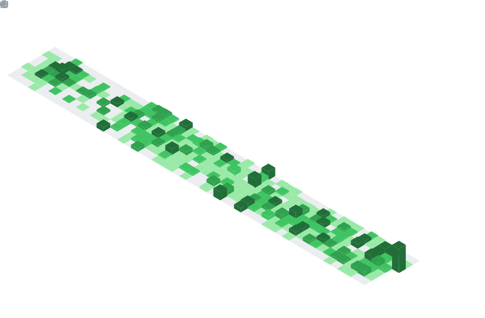

<a href="https://github.com/coldzero94/cold-frame">
  
</a>

AI engineer building production RAG and semantic-search systems — optimizing retrieval quality, latency, and cost end to end. I ship with Python (FastAPI), Go, and TypeScript (Next.js).

- 🔭 **Currently building** developer tools for AI agents
- ✍️ **I write** about AI engineering at [velog.io/@coldzero](https://velog.io/@coldzero)
- 📫 **Reach me** on [LinkedIn](https://www.linkedin.com/in/coldzero)

<!-- AUTO-UPDATE:SHIPPING:START -->
🔨 **Recent pushes:** [nexus](https://github.com/coldzero94/nexus) `2026-07-15` · [cold-frame](https://github.com/coldzero94/cold-frame) `2026-07-13` · [homebrew-coldframe](https://github.com/coldzero94/homebrew-coldframe) `2026-07-03`
<!-- AUTO-UPDATE:SHIPPING:END -->

## Selected work

- **[cold-frame](https://github.com/coldzero94/cold-frame)** — Local-first memory for AI agents: one SQLite file you own, offline, no API key. Ships as a Claude Code plugin for automatic recall + capture. `brew install coldzero94/coldframe/cold-frame`
- **[mindhit](https://github.com/coldzero94/mindhit)** — AI-powered mindmaps from your browsing history: self-hosted, Chrome extension capture, interactive 3D visualization
- **[lockwatcher](https://github.com/coldzero94/lockwatcher)** — macOS background watcher that keeps Claude Code working while your screen is locked

<!-- AUTO-UPDATE:WRITING:START -->

<!-- AUTO-UPDATE:WRITING:END -->

<details>
<summary>📊 Language breakdown — auto-updated daily</summary>
<div align="left">

**Total Code Across All Repositories: 39.7 MB** _(Auto-updated: 2026-07-15)_

<!-- Custom Language Stats with Animation -->
```
Python       ████████████████████░░░░░░░░░░░░░░░░ 58.0%  (AI/ML, FastAPI, Django)
TypeScript   ██████████░░░░░░░░░░░░░░░░░░░░░░░░░░ 28.2%  (Next.js, React, Node.js)
JavaScript   ██░░░░░░░░░░░░░░░░░░░░░░░░░░░░░░░░░░  8.0%  (Frontend, Web)
Go           █░░░░░░░░░░░░░░░░░░░░░░░░░░░░░░░░░░░  3.2%  (Backend, Microservices)
Java         ░░░░░░░░░░░░░░░░░░░░░░░░░░░░░░░░░░░░  0.6%  (Backend, Spring)
Others       ░░░░░░░░░░░░░░░░░░░░░░░░░░░░░░░░░░░░  2.0%  (Shell, Docker, Config)
```

</div>
</details>



<picture>
  <source media="(prefers-color-scheme: dark)" srcset="https://raw.githubusercontent.com/coldzero94/coldzero94/output/github-contribution-grid-snake-dark.svg" />
  <source media="(prefers-color-scheme: light)" srcset="https://raw.githubusercontent.com/coldzero94/coldzero94/output/github-contribution-grid-snake.svg" />
  
</picture>
