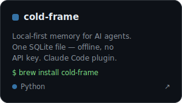
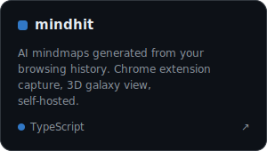
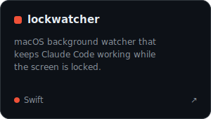

<a href="https://github.com/coldzero94/cold-frame">
  
</a>

AI engineer building production RAG and semantic-search systems — optimizing retrieval quality, latency, and cost end to end. I ship with Python (FastAPI), Go, and TypeScript (Next.js).

- 🔭 **Currently building** developer tools for AI agents
- ✍️ **I write** about AI engineering at [velog.io/@coldzero](https://velog.io/@coldzero)
- 📫 **Reach me** on [LinkedIn](https://www.linkedin.com/in/coldzero)

<!-- AUTO-UPDATE:SHIPPING:START -->
🔨 **Recent pushes:** [nexus](https://github.com/coldzero94/nexus) `2026-07-16` · [cold-frame](https://github.com/coldzero94/cold-frame) `2026-07-13` · [homebrew-coldframe](https://github.com/coldzero94/homebrew-coldframe) `2026-07-03`
<!-- AUTO-UPDATE:SHIPPING:END -->

## Selected work

<p align="center">
  <a href="https://github.com/coldzero94/cold-frame"></a>
  <a href="https://github.com/coldzero94/mindhit"></a>
  <a href="https://github.com/coldzero94/lockwatcher"></a>
</p>

<!-- AUTO-UPDATE:WRITING:START -->

<!-- AUTO-UPDATE:WRITING:END -->

## Languages

<div align="left">

**Total Code Across All Repositories: 4.2 MB** _(Auto-updated: 2026-07-18)_

<!-- Custom Language Stats with Animation -->
```
TypeScript   █████████████░░░░░░░░░░░░░░░░░░░░░░░ 36.4%  (Next.js, React, Node.js)
Go           ██████████░░░░░░░░░░░░░░░░░░░░░░░░░░ 30.3%  (Backend, Microservices)
Python       ███████░░░░░░░░░░░░░░░░░░░░░░░░░░░░░ 20.2%  (AI/ML, FastAPI, Django)
Kotlin       ██░░░░░░░░░░░░░░░░░░░░░░░░░░░░░░░░░░  7.0%  (Development)
HTML         ░░░░░░░░░░░░░░░░░░░░░░░░░░░░░░░░░░░░  1.6%  (Web)
Others       █░░░░░░░░░░░░░░░░░░░░░░░░░░░░░░░░░░░  4.4%  (Shell, Docker, Config)
```

</div>

<picture>
  <source media="(prefers-color-scheme: dark)" srcset="https://raw.githubusercontent.com/coldzero94/coldzero94/output/github-contribution-grid-snake-dark.svg" />
  <source media="(prefers-color-scheme: light)" srcset="https://raw.githubusercontent.com/coldzero94/coldzero94/output/github-contribution-grid-snake.svg" />
  
</picture>
