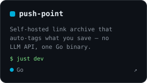
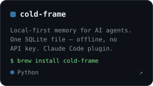
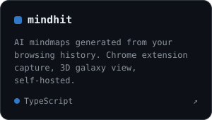
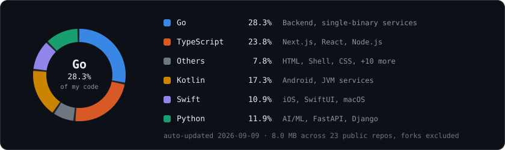

I build systems end to end and keep them small.

Right now that's **[push-point](https://github.com/coldzero94/push-point)** — a self-hosted link archive that auto-tags what you save, without an LLM API. One Go binary on SQLite, a rule-based Korean tagger scored against a frozen golden set, FTS5 search that matches Korean without a morphological analyzer, and iOS, web and browser clients built from one OpenAPI contract. Save p99 is 0.98 ms against a 50 ms target, and a backup is a copy of `data/`.

By day I'm a Forward Deployed Engineer at VESSL AI, building agent platforms end to end — the agents, MCP servers and eval infra behind them — that ship in production vehicles and air-gapped government clouds.

- 🔭 **Currently building** developer tools I use every day — a link archive, memory for AI agents, macOS glue
- 📐 **How I work** — no unmeasured "seems faster": a performance or quality claim comes with the number and the command that produced it
- 📄 **Resume** — [coldzero94.github.io/resume](https://coldzero94.github.io/resume.html)
- 🗂️ **Portfolio** — [coldzero94.github.io](https://coldzero94.github.io) · the agent builders, MCP servers and eval infra in detail
- 📫 **Reach me** on [LinkedIn](https://www.linkedin.com/in/coldzero)

<!-- AUTO-UPDATE:SHIPPING:START -->
🔨 **Recent pushes:** [nexus](https://github.com/coldzero94/nexus) `2026-08-17` · [push-point](https://github.com/coldzero94/push-point) `2026-08-12` · [coldzero94.github.io](https://github.com/coldzero94/coldzero94.github.io) `2026-08-05`
<!-- AUTO-UPDATE:SHIPPING:END -->

## Selected work

  
  
  

<!-- AUTO-UPDATE:WRITING:START -->

<!-- AUTO-UPDATE:WRITING:END -->

## Languages

